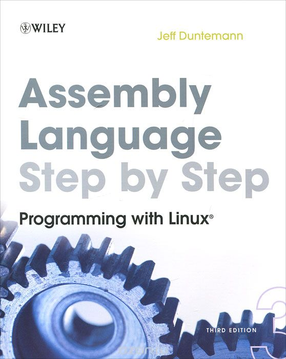

Original code for book **Assembly Language Step–by–Step: Programming with Linux 3 edition** - Jeff Duntemann, 2009


###### Compiling & linking steps on Linux-64bit:
```
nasm -f elf32 -gstabs eatsyscall.asm -o eatsyscall.o
ld -m elf_i386 eatsyscall.o -o eatsyscall
```
